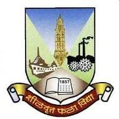
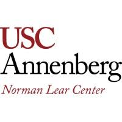

  

  

  
  
  
  
  

  
  &nbsp;
  

---

##  About Me

I'm **Sushil Dalavi**, an **AI Engineer at the USC Annenberg Norman Lear Center** and an **MS in Computer Science candidate at USC** (2024 – 2026).

I architect production AI systems — AWS data platforms, hybrid retrieval pipelines, distributed LLM workflows, and multi-modal ML — with an emphasis on measurable outcomes, reliability, and reproducibility.

 

| | |
|:---:|:---|
| 💼 | Open to **SDE / SWE / AI·ML Engineer / Applied AI** roles |
| 🏗️ | AWS data platforms, distributed workflows, LLM inference gateways |
| 🧠 | Hybrid retrieval, reranking, MLOps, multi-modal alignment |
| 📚 | Building **JobSense**, **ScribeAI**, and **ScholarRAG** |
| 🌍 | Motivated by real-world product impact |
| ⚽ | Proud **Real Madrid** supporter |
| 🍥 | Huge anime geek |

 

---

## 🎓 Education

<table align="center" width="100%">
  <tr>
    <td align="center" width="50%">
       
      
        
      <strong>University of Southern California</strong>
       
      <b>MS in Computer Science</b>
       
      📍 Los Angeles, CA &nbsp;|&nbsp; 📅 Aug 2024 – May 2026
        
      
        
    </td>
    <td align="center" width="50%">
       
      
        
      <strong>University of Mumbai</strong>
       
      <b>BE in Computer Engineering</b>
       
      📍 Mumbai, India &nbsp;|&nbsp; 📅 Jun 2019 – May 2023
        
      
        
    </td>
  </tr>
</table>

---

## 💼 Work Experience

<table align="center" width="100%">
  <tr>
    <td align="center" width="50%">
       
      
        
      <strong>USC Annenberg Norman Lear Center</strong>
       
      <b>AI Engineer</b>
       
      📍 Los Angeles, CA &nbsp;|&nbsp; 📅 Jun 2025 – Present
        
      
        
    </td>
    <td align="center" width="50%">
       
      
        
      <strong>Reliance Jio Platforms</strong>
       
      <b>Software Engineer</b>
       
      📍 Navi Mumbai, India &nbsp;|&nbsp; 📅 Dec 2023 – Jul 2024
        
      
        
    </td>
  </tr>
</table>

  
<b>📌 Highlights from USC Annenberg Norman Lear Center</b>

- Architected an **AWS data platform** (S3, Glue, SageMaker, Bedrock) ingesting, deduplicating, and normalizing **1M+ multi-region records** for downstream ML training and retrieval workloads.
- Shipped a **multi-modal alignment system** fusing audio, speaker diarization, and caption streams — reaching **99.3% F1** and **99.9% coverage** on ground-truth evaluation.
- Developed large-scale batch pipelines processing long-form video and audio through **Whisper ASR**, **pyannote diarization**, and model-based refinement stages.
- Automated dataset QA, Unicode normalization, and deduplication in Python — lifting analysis-ready yield from **10,819 → 9,735 records** with full reproducibility.

  
<b>📌 Highlights from Reliance Jio Platforms</b>

- Trained and deployed **ResNet-50** and **DenseNet-121** deep vision networks for medical image anomaly detection — improving recall by **35%** via transfer learning, augmentation, and loss tuning.
- Optimized **quantized transformer inference** (BERT, GPT-2) on GPU with batched serving — cutting **p95 latency by 30%** while preserving accuracy gains.
- Engineered **demand-forecasting microservices** (TFT, CatBoost, LSTM) over Hive SQL batch pipelines, reducing forecast **MAPE by 25%** for business-critical workloads.
- Rolled out **shadow-testing** and **canary-release** workflows for 3 production ML upgrades, catching 2 latency regressions before fleet-wide deployment.

  

---

## 🛠️ Tech Stack

### Languages

  
  &nbsp;
  
  &nbsp;
  
  &nbsp;
  
  &nbsp;
  

### Frameworks & Backend

  

### Databases & Infrastructure

  

### AI / ML / Data

  
  &nbsp;
  
  
  
  
  
  

### Cloud & Dev Tools

  
  
  
  
  
  
  

---

## 🚀 Featured Projects

<table align="center" width="100%">
  <tr>
    <td width="50%" valign="top" style="padding: 16px;">

### 🧭 [JobSense](https://github.com/sushildalavi)

Durable **distributed workflow platform** — a fault-tolerant orchestration system on Temporal with **12 tool integrations**, human-in-the-loop checkpoints, and a provider-agnostic inference gateway.

**Highlights**
- Temporal-based orchestration with automated retries & end-to-end observability
- Provider-agnostic inference gateway with multi-backend failover & Redis semantic caching
- CI regression gates blocking merges on quality or cost drift
- Hybrid retrieval (BM25 + dense + cross-encoder) fused with Reciprocal Rank Fusion

**Stack**

  </td>
  <td width="50%" valign="top" style="padding: 16px;">

### ✍️ [ScribeAI](https://github.com/sushildalavi)

**Inference service with evaluation pipeline** — async FastAPI service with SSE streaming, multi-backend routing (GPT-4o, Claude, fallback), and an MLflow-tracked evaluation harness.

**Highlights**
- Graceful degradation under upstream failure across multiple LLM backends
- MLflow-tracked evaluation: ROUGE, BLEU, BERTScore, faithfulness, leakage checks
- Compliance-aware pipeline: **10+ PII types** redacted, pgcrypto storage, append-only audit log
- Automated regression alerts on metric drift across versioned releases

**Stack**

  </td>
  </tr>
  <tr>
    <td width="50%" valign="top" style="padding: 16px;">

### 📘 [ScholarRAG](https://github.com/sushildalavi)

**Retrieval and data engineering system** — a hybrid retrieval pipeline for scholarly discovery with citation-aware grounding.

**Highlights**
- Dense + BM25 + RRF + MiniLM rerank lifting **MRR by 21.8%** and **nDCG@10 by 18.0%** over a 120+ query eval harness
- Duplicate indexing reduced by **50%**, re-ingestion time by **60%** via DOI/ID/title normalization + SHA-256 content hashing
- Answer grounding lifted from **0.505 → 0.616** faithfulness; claim support **45.4% → 85.6%**
- Evidence-constrained generation with citation-aware prompting across heterogeneous scholarly sources

**Stack**

  </td>
  <td width="50%" valign="top" style="padding: 16px;">

### 🏥 [MedSOAP](https://github.com/sushildalavi/Med_SOAP)

**Clinical documentation automation** — generates structured SOAP notes from doctor-patient conversations.

**Highlights**
- LLM-driven SOAP note generation with medical entity recognition
- HIPAA-conscious architecture with audit trails
- Fine-tuning and evaluation pipeline for clinical summarization
- Explores healthcare-focused product design patterns

**Stack**

  </td>
  </tr>
</table>

---

## 📊 GitHub Analytics

  
  &nbsp;&nbsp;
  

  

  

---

## 🏆 Trophies

  

---

## 💬 Quote I Live By

   
  
    
  <b>— Aristotle</b>
    

---

## 🎯 Beyond the Code

  
  
  
  
  
  

<table align="center">
  <tr>
    <td>🎬</td><td>Love webseries and serious binge watching</td>
    <td>🏊</td><td>Swimming keeps me grounded</td>
  </tr>
  <tr>
    <td>🏓</td><td>Enjoy table tennis</td>
    <td>⚽</td><td>Lifelong football fan</td>
  </tr>
  <tr>
    <td>🍥</td><td>Huge anime geek</td>
    <td>🎧</td><td>Music always around</td>
  </tr>
</table>

---

## ⚽ Hala Madrid

  
  &nbsp;
  

  A proud <strong>Real Madrid</strong> supporter — I love the mentality, the standards, the legacy, and the winning culture.

---

## 🎧 Spotify

  

---

## 🔍 What I'm Looking For

  
  
  
  
  
  

  I'm especially interested in opportunities where strong <strong>software engineering</strong> meets <strong>AI/ML</strong>, <strong>backend systems</strong>, and <strong>data-driven product building</strong>.

---

## 🤝 Let's Connect

  
  
  
  
  

  
  &nbsp;
  

  

